# LionHome 后端技术设计文档

| 字段 | 内容 |
|---|---|
| 文档版本 | 1.0 |
| 状态 | Draft |
| 技术栈 | Next.js 15 API Routes · Supabase Postgres · Supabase Auth · Resend · Twilio |
| 覆盖范围 | MVP Phase 1–3 后端核心链路 |
| 更新日期 | 2026-05-10 |

---

## 目录

1. [系统架构总览](#1-系统架构总览)
2. [Use Case 清单](#2-use-case-清单)
3. [UC-01 购房力测算](#uc-01-购房力测算)
4. [UC-02 买家体检 Quiz](#uc-02-买家体检-quiz)
5. [UC-03 用户注册与身份认证](#uc-03-用户注册与身份认证)
6. [UC-04 线索采集与分层 Consent](#uc-04-线索采集与分层-consent)
7. [UC-05 Lead 自动评分](#uc-05-lead-自动评分)
8. [UC-06 Lead 分发与独占管理](#uc-06-lead-分发与独占管理)
9. [UC-07 中介跟进状态更新](#uc-07-中介跟进状态更新)
10. [UC-08 成交归因（三方确认）](#uc-08-成交归因三方确认)
11. [UC-09 佣金结算](#uc-09-佣金结算)
12. [数据库设计](#12-数据库设计)
13. [API 端点总览](#13-api-端点总览)
14. [关键设计决策](#14-关键设计决策)

---

## 1. 系统架构总览

```
┌─────────────────────────────────────────────────────────────────┐
│                         客户端层                                  │
│   C端 Web (Next.js)   │  Admin Lead OS   │  Agent Lite Portal    │
└──────────┬────────────┴──────────┬────────┴──────────┬───────────┘
           │                       │                    │
           ▼                       ▼                    ▼
┌─────────────────────────────────────────────────────────────────┐
│                    API 层 (Next.js Route Handlers)               │
│  /api/v1/*  (anon/auth)  │  /api/admin/v1/*  │  /api/agent/v1/* │
└──────────────────────────┴───────────┬─────────┴─────────────────┘
                                       │
           ┌───────────────────────────┼───────────────────┐
           ▼                           ▼                    ▼
┌─────────────────┐        ┌──────────────────┐  ┌─────────────────┐
│  Supabase DB    │        │  Supabase Auth   │  │  外部服务        │
│  (Postgres+RLS) │        │  (OTP/Magic Link)│  │  Twilio WhatsApp│
│                 │        └──────────────────┘  │  Resend Email   │
│  lib/tax/       │                               │  URA API        │
│  lib/scoring/   │                               └─────────────────┘
└─────────────────┘
```

### 核心分层原则

- **纯函数层**（`lib/tax/`、`lib/scoring/`）：无副作用，单独测试，读取 DB 配置但不写入
- **API 层**：负责鉴权、参数校验（zod）、调用纯函数、写 DB、发送通知
- **DB 层**：RLS 为默认 deny；service-role 用于 admin/agent 后台；anon key 用于 C 端匿名操作
- **外部通知**：WhatsApp（Twilio）和 Email（Resend）仅由后端发起，客户端不直接调用

---

## 2. Use Case 清单

| ID | Use Case | 参与者 | 优先级 |
|---|---|---|---|
| UC-01 | 购房力测算（含匿名） | C 端用户（匿名/已登录） | P0 |
| UC-02 | 买家体检 Quiz | C 端用户（匿名/已登录） | P0 |
| UC-03 | 用户注册与身份认证 | C 端用户 | P0 |
| UC-04 | 线索采集与分层 Consent | C 端用户 | P0 |
| UC-05 | Lead 自动评分 | 系统（后台触发） | P1 |
| UC-06 | Lead 分发与独占管理 | Admin、系统 | P1 |
| UC-07 | 中介跟进状态更新 | Agent | P1 |
| UC-08 | 成交归因（三方确认） | Agent、C 端用户、Admin | P1 |
| UC-09 | 佣金结算 | Admin | P2 |

---

## UC-01 购房力测算

### 参与者
- 主角：C 端用户（匿名或已登录）
- 系统：税率引擎（`lib/tax/`）、税率同步服务（`lib/tax/sync`）、Supabase DB

### 业务目标
以免费工具吸引用户，同时采集身份、收入、预算等核心 Lead 评分字段。**计算本身完全无状态**，不写 DB；仅当用户主动留下联系方式（Layer 1）或完成登录后，才将本次计算结果持久化，关联到该用户。

### 前置条件
- 用户已到达 `/calculator` 页面（可从 UTM 链接进入）
- `tax_rates` 表有有效行是**期望**状态；为空时系统自动触发同步（见异常流程）

---

### 错误响应规范

所有 UC-01 相关接口均使用统一的业务错误 Envelope，**不依赖 HTTP 状态码语义传递业务失败原因**。

```
成功响应（HTTP 200）：
{
  "ok": true,
  "data": { ... }
}

失败响应（HTTP 200）：
{
  "ok": false,
  "error": {
    "code": "<ERROR_CODE>",      // 机器可读的业务错误码
    "message": "<中文描述>",     // 面向开发者的描述，不直接展示给用户
    "retryAfter"?: <seconds>     // 可选，告知前端建议重试间隔
  }
}
```

> **为什么不用 HTTP 错误码传递业务错误**：HTTP 4xx/5xx 会被 CDN、监控、前端框架等中间层截断或特殊处理，业务错误码更稳定、更利于前端统一处理，也方便日志精确聚合。

**UC-01 业务错误码清单**：

| 错误码 | 触发场景 | 建议 retryAfter |
|---|---|---|
| `INVALID_INPUT` | zod 校验失败，附 `fields` 字段列出具体字段 | — |
| `TAX_RATES_UNAVAILABLE` | 税率表为空，同步已触发，等待结果 | 15 |
| `TAX_RATES_SYNC_FAILED` | 税率表为空，同步失败，无法计算 | 300 |
| `CALC_INTERNAL_ERROR` | 税率引擎抛出意外异常 | — |

---

### 主流程（计算，不写 DB）

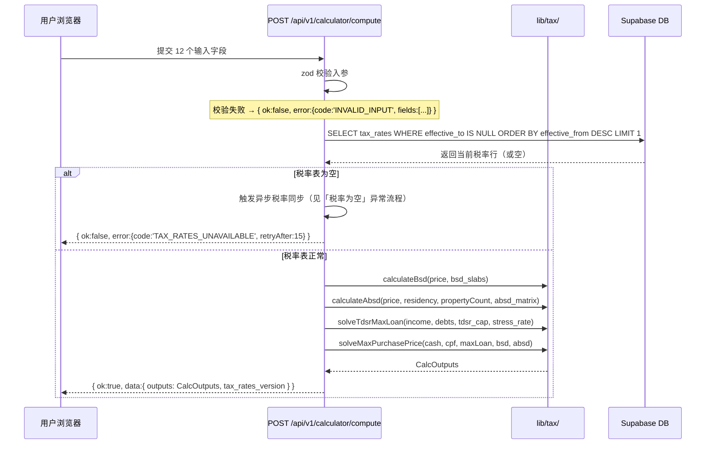

> 本流程**不写任何 DB 表**。`CalcOutputs` 由前端缓存在 React state / sessionStorage，仅在用户留资或登录后持久化。

---

### 异常流程：税率表为空 → 触发同步

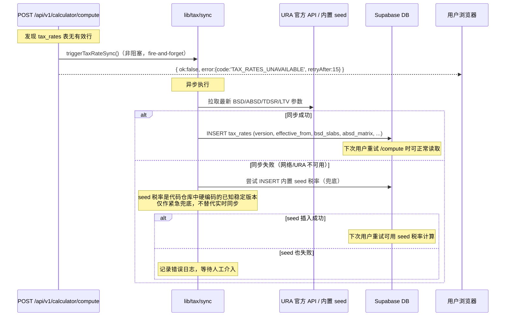

**前端处理**：收到 `TAX_RATES_UNAVAILABLE` 后，在结果区域展示加载状态并在 `retryAfter` 秒后自动重试一次 `/compute`；超过 2 次重试仍失败则展示"系统正在维护"提示。

---

### 数据持久化流程（留资或登录后触发）

测算结果仅在以下两个时机写入 DB：

**时机 A：用户填写联系方式（Layer 1 留资）**

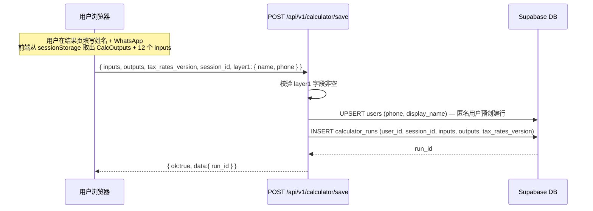

**时机 B：已登录用户主动保存（点击"保存测算"）**

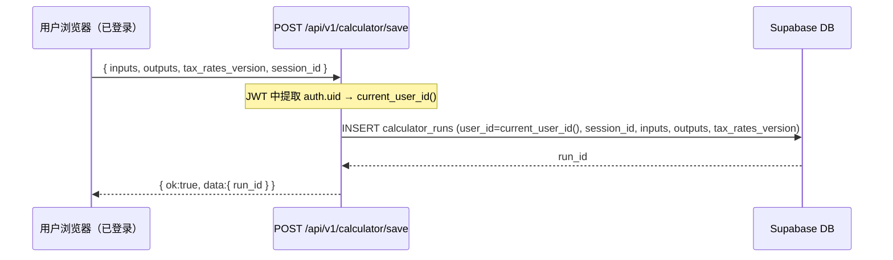

> 两个时机复用同一个 `/api/v1/calculator/save` 端点，身份由 JWT 有无决定走哪条分支。`run_id` 返回后前端存入 localStorage，Quiz 提交和 Lead 提交时携带。

---

### 其他异常流程

| 场景 | 处理 |
|---|---|
| TDSR 无法覆盖任何购房价 | `outputs.max_price = 0`，`outputs.infeasible_reason = 'TDSR_EXCEEDED'`；HTTP 200 + `ok:true`，前端按此字段渲染引导内容 |
| 外籍人士 ABSD 60% | 正常计算，`outputs.absd_warning = true`，前端展示醒目提示；不视为错误 |
| 税率引擎抛出异常 | `{ ok:false, error:{ code:'CALC_INTERNAL_ERROR' } }`；同时写后端错误日志 |
| 重复提交相同输入 | `/compute` 无状态，幂等；`/save` 每次生成新 `run_id` |

---

### CalcOutputs 结构体（前端缓存 + 持久化 jsonb）

```json
{
  "max_price": 2180000,
  "loan_amount": 1635000,
  "down_payment": { "cash": 300000, "cpf": 245000 },
  "bsd": 64600,
  "absd": 109000,
  "absd_rate": 0.05,
  "legal_fees_est": 3200,
  "total_upfront_cash": 477800,
  "monthly_payment": { "base": 7820, "stress": 9640 },
  "tdsr_utilization": 0.44,
  "absd_warning": false,
  "infeasible_reason": null,
  "scenarios": [...]
}
```

### 后置条件
- `/compute` 不写 DB，结果存于前端 sessionStorage
- 用户留资或登录后，`/save` 将结果持久化到 `calculator_runs`，`run_id` 存入 localStorage
- Quiz 提交和 Lead 提交时携带 `run_id` 关联

---

## UC-02 买家体检 Quiz

### 参与者
- 主角：C 端用户（匿名或已登录）
- 系统：评分引擎（`lib/scoring/`）

### 业务目标
对用户进行买家类型分类（5 种 archetype）和购买准备度评分（0–100），驱动个性化结果页，并作为 Lead 评分的核心输入。

### 前置条件
- 用户已完成 8 道题（Q1–Q7 必填，Q8 选填）
- 可选：已有关联的 `calculator_run_id`（用于加分）

### 主流程

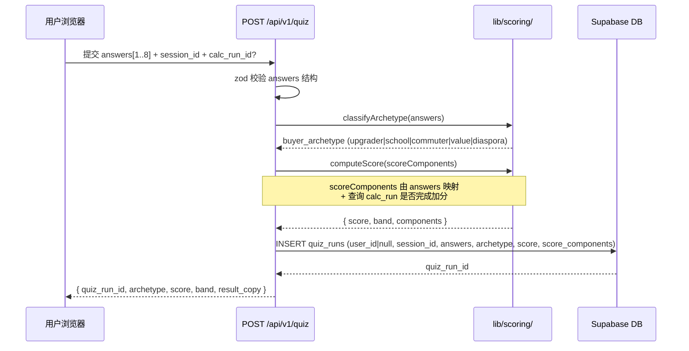

### 评分映射规则

```
ScoreComponents {
  timeline:           Q2 答案 → [30, 20, 10, 5, 0]
  budget_clarity:     calc_run 是否完成 → [20, 10, 0]
  income_alignment:   calc_run.tdsr_utilization → [15, 10, 0]
  confidence:         Q7 slider(1-5) × 3 → [3,6,9,12,15]
  agent_history:      Q5 答案 → [10, 5, 0, -5]
  concern_specificity:Q6 是否具体 → [5, 0]
  free_text_quality:  Q8 length > 20 → [5, 0]
}
Score = clamp(sum(components), 0, 100)
```

### Archetype 分类逻辑（决策树）

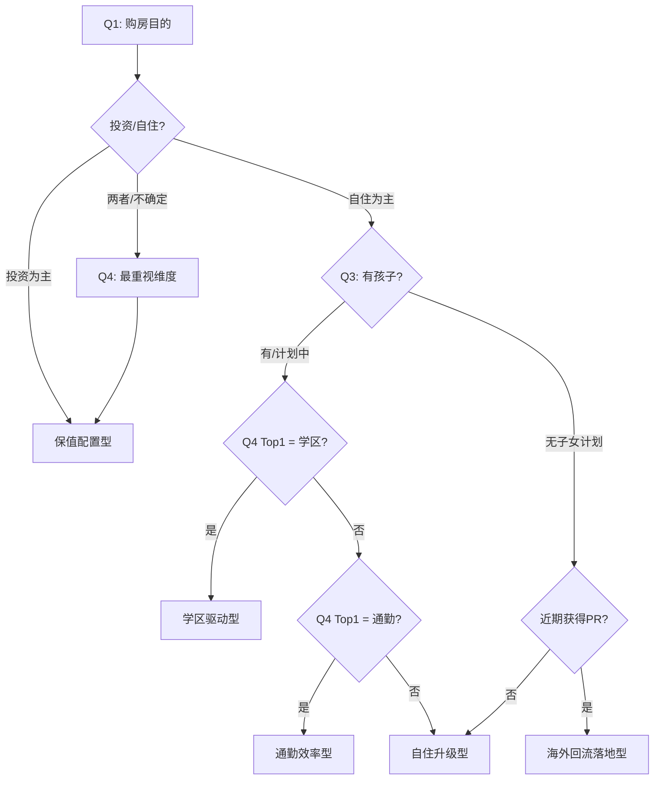

### 后置条件
- `quiz_runs` 写入成功
- `quiz_run_id` 返回前端，存入 localStorage
- 结果页 `/result/{quiz_run_id}` 可直接渲染，无需登录

---

## UC-03 用户注册与身份认证

### 参与者
- 主角：C 端用户
- 系统：Supabase Auth（OTP），`users` 表

### 业务目标
采用"先体验，后注册"策略，注册仅在用户需要保存结果、预约顾问时触发。支持 WhatsApp 手机号 OTP 和 Email Magic Link 两种方式。

### 注册触发时机

```
用户点击以下任一动作 → 触发注册弹窗：
  - "保存我的测算结果"
  - "查看完整报告"
  - "预约15分钟顾问咨询"
  - "获取个性化策略报告"
```

### 主流程（OTP 手机号注册）

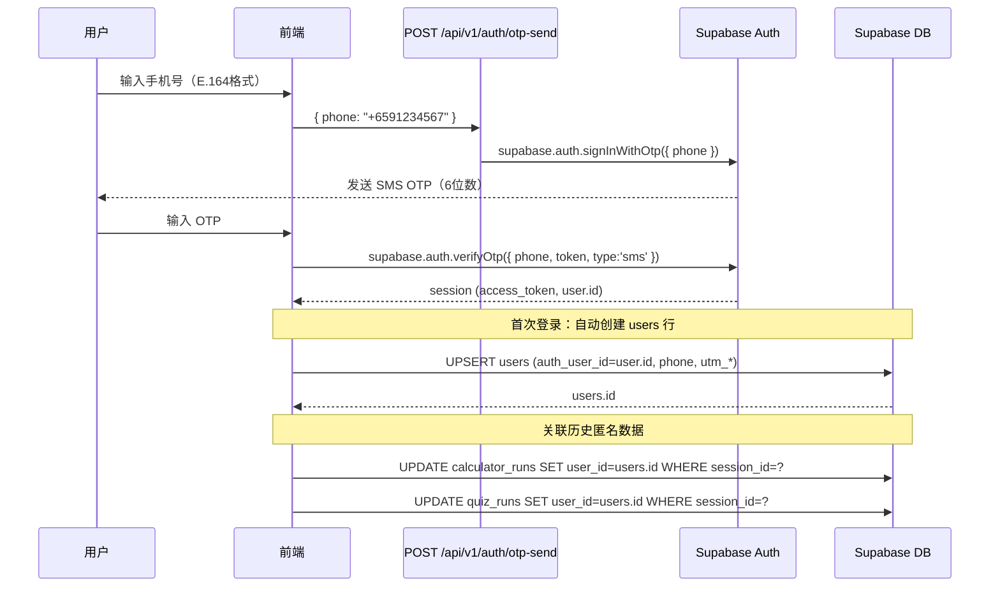

### 会话状态机

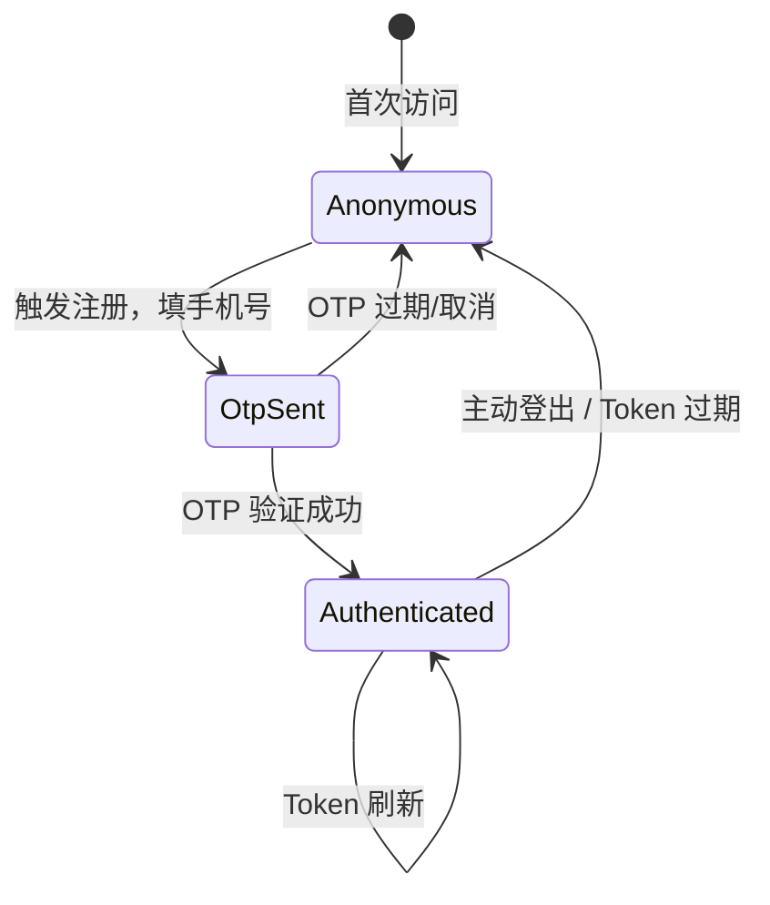

### 异常流程

| 场景 | 处理 |
|---|---|
| 手机号已注册 | Supabase Auth 直接发新 OTP（同一 auth.user 复用） |
| OTP 错误 3 次 | Supabase Auth 内置限速，返回 429 |
| 用户取消注册 | 历史匿名 `calculator_runs`/`quiz_runs` 保留在 session，下次登录再关联 |
| Email Magic Link 方式 | 同流程，替换 `signInWithOtp({ email })` |

---

## UC-04 线索采集与分层 Consent

### 参与者
- 主角：C 端用户（已登录）
- 系统：`leads`、`consent_log`、`lead_journey_events`

### 三层递进式采集

```mermaid
flowchart LR
    subgraph L1["第一层（低门槛）"]
        direction TB
        L1A[姓名]
        L1B[WhatsApp]
        L1C[购房目的]
        L1D[计划时间]
    end

    subgraph L2["第二层（看到结果后）"]
        direction TB
        L2A[身份状态]
        L2B[婚姻状态]
        L2C[预算区间]
        L2D[收入区间]
        L2E[现有房产]
    end

    subgraph L3["第三层（预约顾问前）"]
        direction TB
        L3A[主要决策人]
        L3B[最大顾虑]
        L3C[是否已接触中介]
        L3D[授权数据分享给中介]
    end

    L1 -->|提交后看部分结果| L2
    L2 -->|提交后看完整报告| L3
    L3 -->|授权后进入撮合流程| 线索分发
```

### 主流程（第三层提交 → Lead 创建）

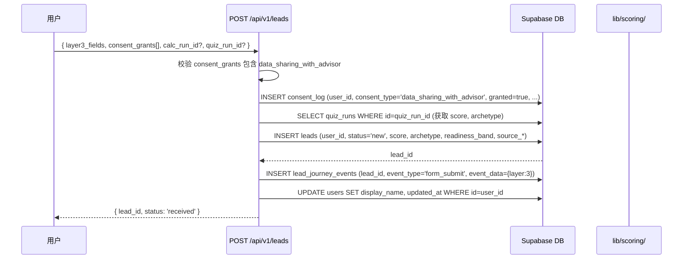

### Consent 写入规则

每次 Consent 变更均写入 `consent_log` 新行，**永不修改或删除**。

```
consent_type 枚举:
  privacy_policy          — 首次访问时确认
  data_sharing_with_advisor — 第三层必选，未授权不创建 lead
  marketing_email         — 可选
  marketing_whatsapp      — 可选
  cookies                 — 首次访问 banner

撤销: INSERT 新行 { granted: false, withdrawn_at: now() }
       同时 UPDATE 原行 withdrawn_at（通过 SECURITY DEFINER function）
```

### Lead 状态机

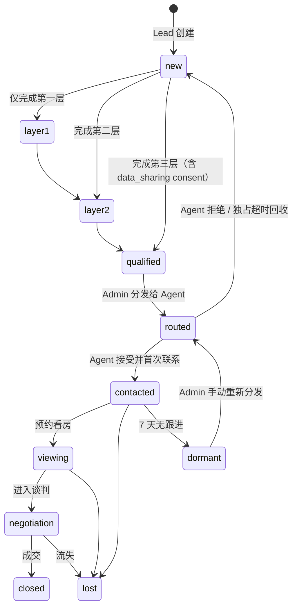

---

## UC-05 Lead 自动评分

### 参与者
- 系统（由 Lead 创建/更新事件触发）
- `lib/scoring/computeScore`

### 触发时机
1. `leads` 行首次插入时（INSERT trigger 或 API 层调用）
2. `quiz_runs` 关联完成时
3. `calculator_runs` 关联完成时

### 主流程

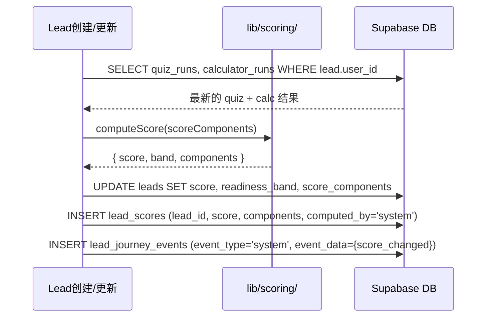

### 评分组件与权重

| 维度 | 最高分 | 数据来源 |
|---|---|---|
| timeline | 30 | quiz Q2 |
| budget_clarity | 20 | calculator_run 完成度 |
| income_alignment | 15 | calc tdsr_utilization |
| confidence | 15 | quiz Q7 × 3 |
| agent_history | 10 | quiz Q5 |
| concern_specificity | 5 | quiz Q6 |
| free_text_quality | 5 | quiz Q8 |
| **总计** | **100** | |

### Band 分级与路由动作

| Band | 分数区间 | 后续动作 |
|---|---|---|
| hot | 85–100 | 2 小时内强制路由给 agent |
| warm | 60–84 | 进入路由队列，ops 审核 |
| cool | 40–59 | 推送内容，30 天后重评 |
| cold | 0–39 | 仅保留邮件列表，不路由 |

---

## UC-06 Lead 分发与独占管理

### 参与者
- Admin（手动触发或系统自动）
- Agent

### 匹配算法（MVP 规则引擎）

```
候选 Agent 过滤条件：
  1. agents.status = 'active'
  2. agent_profile.specializations->'buyer_archetypes' ⊇ [lead.buyer_archetype]
  3. agent_profile.specializations->'districts' ∩ lead.preferred_districts ≠ ∅
  4. 最近 30 天 lead_assignments.accepted / total < 80%（防止堆积）

排序：
  1. agent_tier: top > mid > probation
  2. 最近 30 天成交率 desc
  3. 最近 30 天首次响应速度 asc
```

### 主流程

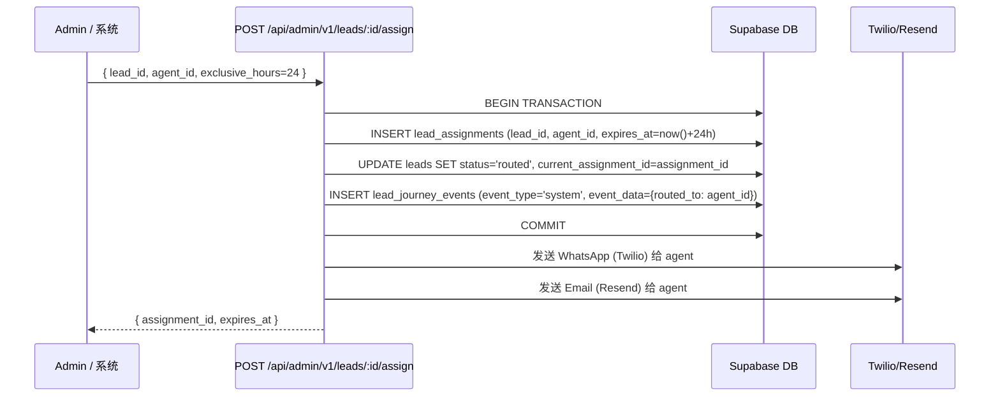

### 独占时效管理

```mermaid
flowchart TD
    A[Agent 收到通知] --> B{24小时内操作?}
    B -->|接受 Accept| C[lead_assignments.accepted_at = now()]
    C --> D[向 Agent 披露完整手机号]
    D --> E[lead.status = contacted]
    B -->|拒绝 Decline| F[lead_assignments.declined_at = now()]
    F --> G[lead.status = new]
    G --> H[重新进入分发队列]
    B -->|超时未响应| I[cron job 检测 expires_at < now()]
    I --> F
```

### 超时回收 Cron

- 每 15 分钟运行一次（Vercel Cron 或 Supabase pg_cron）
- 查询 `lead_assignments WHERE expires_at < now() AND accepted_at IS NULL AND declined_at IS NULL`
- 自动写入 `declined_at`，触发重分发逻辑

---

## UC-07 中介跟进状态更新

### 参与者
- Agent（通过 Agent Lite Portal）

### 状态流转限制

```
Agent 只能将 lead 推进，不能回退：
  contacted → viewing → negotiation → closed / lost
  contacted → lost
  viewing → lost
```

### 主流程

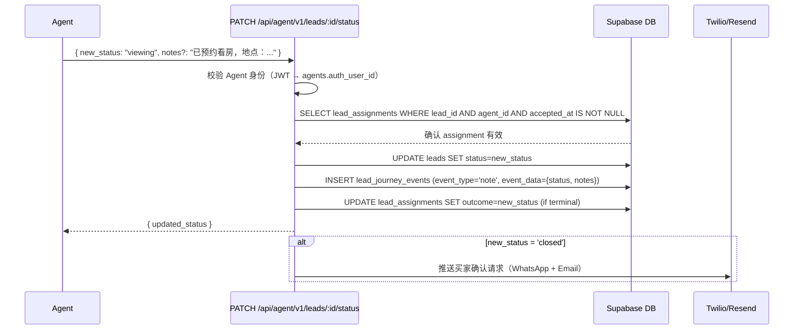

### Agent 可见字段权限

| 字段 | 分配前 | 接受后 |
|---|---|---|
| 买家姓名 | 脱敏（仅首字） | 完整 |
| 手机号 | 隐藏 | 显示 |
| 预算区间 | 显示 | 显示 |
| 买家类型/评分 | 显示 | 显示 |
| 完整 quiz 回答 | 隐藏 | 显示 |

---

## UC-08 成交归因（三方确认）

### 参与者
- Agent（申报成交）
- 买家（确认）
- Admin（最终验证）

### 三方确认流程

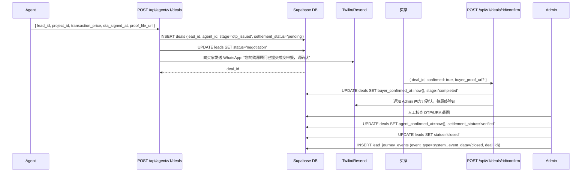

### 归因链路完整性要求

成交记录必须包含以下所有时间戳才能触发结算：

```
lead.created_at              ← 首次留资时间
consent_log.granted_at       ← data_sharing consent 时间
lead_assignments.assigned_at ← 分配给中介时间
lead_assignments.accepted_at ← 中介首次接受时间
deals.ota_signed_at          ← OTA 签署日期（中介提供）
deals.buyer_confirmed_at     ← 买家确认时间
deals.agent_confirmed_at     ← Admin 最终验证时间
```

---

## UC-09 佣金结算

### 参与者
- Admin

### 结算触发条件
`deals.settlement_status = 'verified'` 且 `deals.buyer_confirmed_at IS NOT NULL`

### 主流程

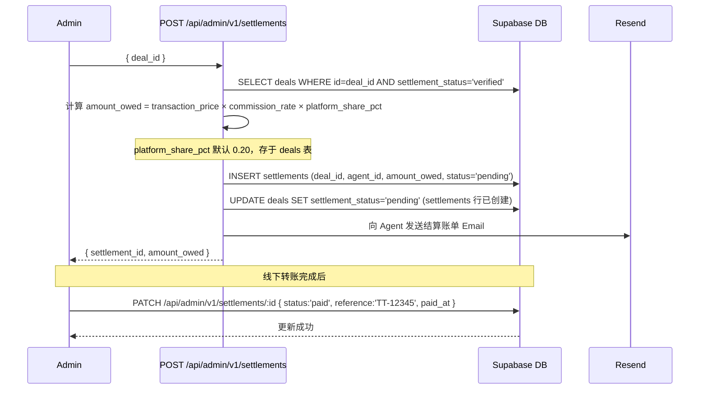

### 结算状态机

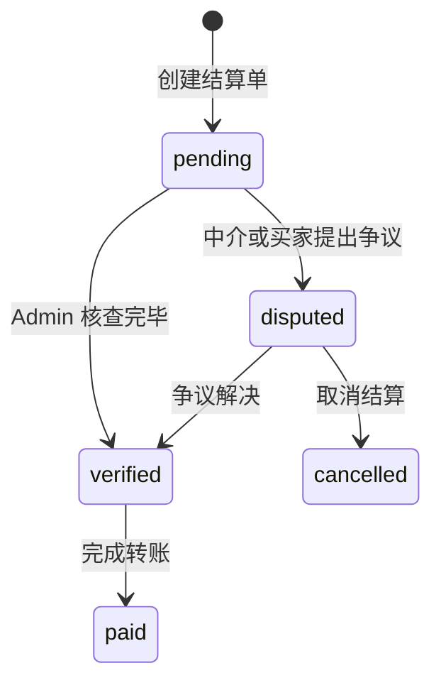

---

## 12. 数据库设计

### 12.1 实体关系图（ER Diagram）

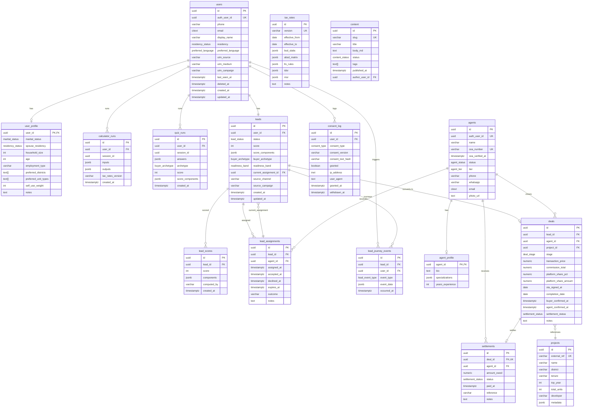

### 12.2 关键索引设计

```sql
-- 高频查询：按评分排序的 hot/warm leads
CREATE INDEX leads_score_band_idx ON leads (readiness_band, score DESC)
  WHERE status NOT IN ('closed', 'lost', 'dormant');

-- Lead OS：按状态 + 创建时间筛选
CREATE INDEX leads_status_created_idx ON leads (status, created_at DESC);

-- 独占超时扫描（cron job）
CREATE INDEX assignments_expiry_idx ON lead_assignments (expires_at)
  WHERE accepted_at IS NULL AND declined_at IS NULL;

-- Agent 绩效计算
CREATE INDEX assignments_agent_outcome_idx ON lead_assignments (agent_id, assigned_at DESC);

-- Consent 合规查询
CREATE INDEX consent_user_type_idx ON consent_log (user_id, consent_type, granted_at DESC);

-- 内容 CMS 分页
CREATE INDEX content_published_idx ON content (status, published_at DESC)
  WHERE status = 'published';

-- 税率有效版本（高频读）
CREATE INDEX tax_rates_active_idx ON tax_rates (effective_from DESC)
  WHERE effective_to IS NULL;
```

### 12.3 Enum 类型总览

```sql
residency_status:      citizen | pr | foreigner | company
marital_status:        single | married | married_foreign_spouse
preferred_language:    zh-CN | zh-TW | en
lead_status:           new | layer1 | layer2 | qualified | routed |
                       contacted | viewing | negotiation | closed | lost | dormant
buyer_archetype:       upgrader | school | commuter | value | diaspora
readiness_band:        hot | warm | cool | cold
agent_status:          active | paused | removed
agent_tier:            top | mid | probation | removed
deal_stage:            lead | contacted | viewing | negotiation |
                       otp_issued | completed | lost
settlement_status:     pending | verified | paid | disputed
consent_type:          privacy_policy | data_sharing_with_advisor |
                       marketing_email | marketing_whatsapp | cookies
lead_event_type:       page_view | cta_click | form_start | form_submit |
                       chat_message | note | system
content_status:        draft | scheduled | published | archived
```

### 12.4 RLS 访问矩阵

| 表 | anon | authenticated (自己) | agent (自己) | service-role |
|---|---|---|---|---|
| users | ✗ | R/W | ✗ | R/W |
| user_profile | ✗ | R/W | ✗ | R/W |
| calculator_runs | INSERT(user_id=null) | R/INSERT | ✗ | R/W |
| quiz_runs | INSERT(user_id=null) | R/INSERT | ✗ | R/W |
| leads | ✗ | R(自己) | R(assigned) | R/W |
| lead_scores | ✗ | R(自己) | ✗ | R/W |
| lead_assignments | ✗ | R(自己) | R/W(自己) | R/W |
| lead_journey_events | ✗ | R(自己) | ✗ | R/W |
| consent_log | INSERT(null) | INSERT/R | ✗ | R |
| agents | ✗ | ✗ | R/W(自己) | R/W |
| agent_profile | ✗ | ✗ | R/W(自己) | R/W |
| deals | ✗ | ✗ | R/W(自己) | R/W |
| settlements | ✗ | ✗ | R(自己) | R/W |
| projects | R | R | R | R/W |
| content | R(published) | R(published) | R(published) | R/W |
| tax_rates | R(active) | R(active) | R(active) | R/W |
| config | R(active) | R(active) | R(active) | R/W |

---

## 13. API 端点总览

### C 端 API（`/api/v1/`）

| Method | Path | Auth | UC |
|---|---|---|---|
| POST | `/api/v1/calculator/compute` | anon/auth | UC-01（无状态计算，不写 DB） |
| POST | `/api/v1/calculator/save` | anon/auth | UC-01（留资或登录后持久化） |
| GET | `/api/v1/calculator/:run_id` | auth | UC-01 |
| POST | `/api/v1/quiz` | anon/auth | UC-02 |
| GET | `/api/v1/quiz/:run_id` | auth | UC-02 |
| POST | `/api/v1/auth/otp-send` | anon | UC-03 |
| POST | `/api/v1/leads` | auth | UC-04 |
| POST | `/api/v1/consent` | anon/auth | UC-04 |
| GET | `/api/v1/leads/:id` | auth | UC-04 |
| POST | `/api/v1/deals/:id/confirm` | auth | UC-08 |
| GET | `/api/v1/health` | anon | — |
| GET | `/api/v1/health/db` | anon | — |

### Admin API（`/api/admin/v1/`）

| Method | Path | Auth | UC |
|---|---|---|---|
| GET | `/api/admin/v1/leads` | admin | UC-05/06 |
| GET | `/api/admin/v1/leads/:id` | admin | UC-05 |
| POST | `/api/admin/v1/leads/:id/assign` | admin | UC-06 |
| POST | `/api/admin/v1/leads/:id/score` | admin | UC-05 |
| GET | `/api/admin/v1/agents` | admin | UC-06 |
| POST | `/api/admin/v1/agents` | admin | — |
| GET | `/api/admin/v1/deals` | admin | UC-08 |
| PATCH | `/api/admin/v1/deals/:id` | admin | UC-08 |
| POST | `/api/admin/v1/settlements` | admin | UC-09 |
| PATCH | `/api/admin/v1/settlements/:id` | admin | UC-09 |
| GET | `/api/admin/v1/health` | admin | — |

### Agent API（`/api/agent/v1/`）

| Method | Path | Auth | UC |
|---|---|---|---|
| GET | `/api/agent/v1/leads` | agent | UC-07 |
| GET | `/api/agent/v1/leads/:id` | agent | UC-07 |
| POST | `/api/agent/v1/leads/:id/accept` | agent | UC-06 |
| POST | `/api/agent/v1/leads/:id/decline` | agent | UC-06 |
| PATCH | `/api/agent/v1/leads/:id/status` | agent | UC-07 |
| POST | `/api/agent/v1/deals` | agent | UC-08 |
| GET | `/api/agent/v1/settlements` | agent | UC-09 |

---

## 14. 关键设计决策

### D1: 匿名 → 认证数据迁移

**决策**：用户匿名完成测算/Quiz 后，登录时通过 `session_id` 批量关联历史数据（UPDATE `user_id`）。

**理由**：强制注册导致漏斗断裂，"先体验后注册"是 PRD 核心转化策略。

**风险**：session_id 存在 localStorage，跨设备无法自动合并。**接受**，MVP 阶段用户通常在单设备完成流程。

---

### D2: 税率不硬编码

**决策**：BSD slabs、ABSD matrix、TDSR cap、LTV rules 全部读 `tax_rates` 表，计算引擎不含任何硬编码数字。

**理由**：新加坡 IRAS 税率历史上已多次调整（2023 ABSD 大幅上调），硬编码会在监管变化时造成计算错误，影响用户决策。

**实现**：每次 `/api/v1/calculator` 请求读最新有效行；`calculator_runs.tax_rates_version` 字段永久记录计算时使用的税率版本，便于事后审计。

---

### D3: Consent 表 append-only

**决策**：`consent_log` 表级别 REVOKE UPDATE/DELETE，撤销授权通过新增 `granted=false` 行实现。

**理由**：PDPA 合规要求能够证明用户在特定时间点的同意状态，可变记录无法满足合规举证要求。

---

### D4: Lead 手机号分阶段披露

**决策**：Agent 接受 lead 前，手机号字段不返回（API 层 mask，而非 DB 层加密）；接受后完整返回。

**理由**：MVP 阶段优先实现业务逻辑，PII 列级加密（pgcrypto）作为下一里程碑实施。

**迁移路径**：PII 列加密上线后，解密权限仅授予 service-role，现有 mask 逻辑替换为解密调用。

---

### D5: 结算由 Admin 手动触发

**决策**：MVP 阶段结算不自动化，Admin 在核查 OTP/URA 截图后手动创建 `settlements` 行。

**理由**：单月成交量 < 10 单，自动化收益不抵合规风险（错误打款）。Phase 4+ 再实现自动化。

---

### D6: 独占超时用 Cron 而非 DB Trigger

**决策**：Agent 独占超时检测通过 Vercel Cron（每 15 分钟）或 Supabase `pg_cron` 扫描，不用 PostgreSQL trigger。

**理由**：DB trigger 在超时点精确触发需要 `pg_cron` + background worker，增加运维复杂度；15 分钟的检测延迟在 24 小时独占窗口下完全可接受。
