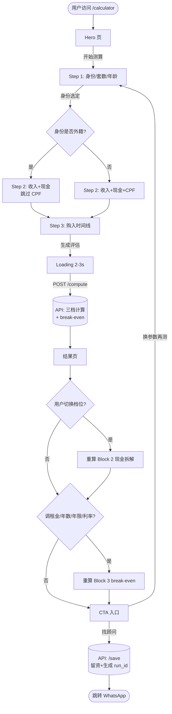
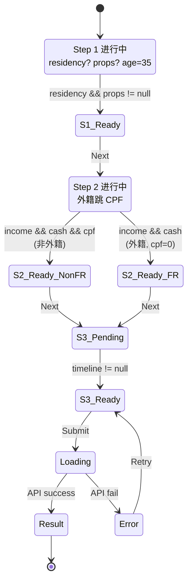
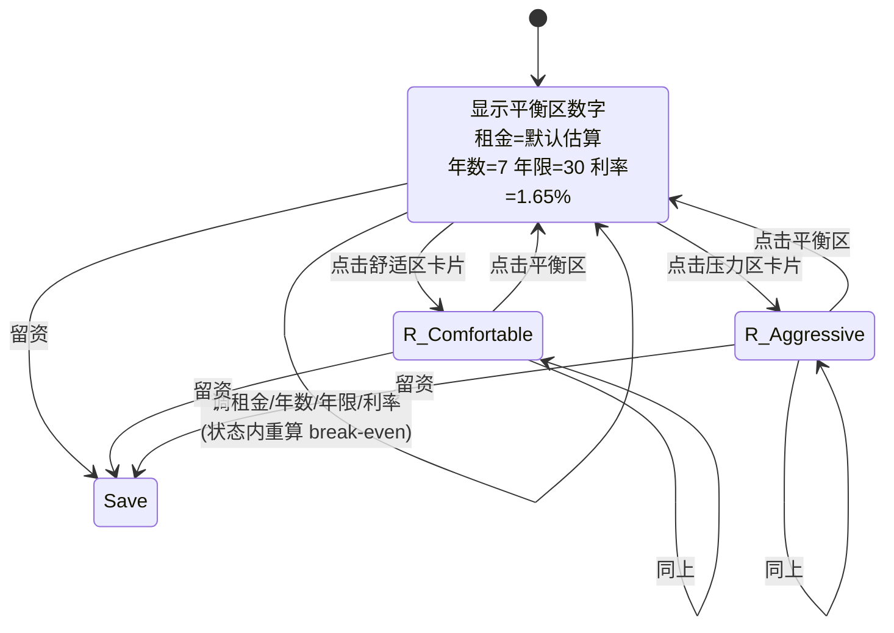

# Calculator V2 — 技术设计文档 (TD)

> 配套 PRD：[CALCULATOR_V2_SPEC.md](./CALCULATOR_V2_SPEC.md)
> UI 原型：[prototypes/f/](../prototypes/f/)
> 目的：把 PRD 里的"理性购房决策器"翻译成可实施的工程方案。

---

## 目录

1. [范围与现状](#1-范围与现状)
2. [流程图](#2-流程图)
3. [状态机](#3-状态机)
4. [引擎层设计](#4-引擎层设计)
5. [API 设计](#5-api-设计)
6. [数据模型](#6-数据模型)
7. [测试策略](#7-测试策略)
8. [边界与性能](#8-边界与性能)
9. [实施顺序与工作量](#9-实施顺序与工作量)
10. [待决问题](#10-待决问题)

---

## 1. 范围与现状

### 1.1 V2 要交付的能力

| 能力 | 现版本（V1） | V2 |
|---|---|---|
| 输入字段 | 11 项 | **7 项**（外籍 6 项） |
| 输出 | 1 个 `max_price` | **3 档区间** + 现金需求 + break-even（首套） |
| 月供占比 | 隐含 55%（MAS） | **3 档可选**：30% / 35% / 55% |
| 买 vs 租 | 无 | **有**，首套显示 |
| 结果页参数微调 | 利率、年限可调 | **租金/年数/年限/利率**全可调，实时联动 |

### 1.2 复用的现有代码

| 文件 | 现状 | V2 中怎么用 |
|---|---|---|
| [lib/tax/tdsr.ts](../lib/tax/tdsr.ts) | `solveMaxPurchasePrice()` 隐含 ratio=55% | **改造**为可参数化 `solveByMonthlyRatio(ratio, params)` |
| [lib/tax/tdsr.ts](../lib/tax/tdsr.ts) | `isFeasibleAtPrice()` (file-local) | **export**，break-even 模块要用 |
| [lib/tax/tdsr.ts](../lib/tax/tdsr.ts) | `buildOutput(price, params, reason)` (file-local) | **export**，给定房价输出全数字 |
| [lib/tax/bsd.ts](../lib/tax/bsd.ts) | `calculateBsd()` | 完全复用 |
| [lib/tax/absd.ts](../lib/tax/absd.ts) | `calculateAbsd()` | 完全复用 |
| [lib/tax/seed.ts](../lib/tax/seed.ts) | `SEED_TAX_RATES` | 完全复用 |
| [db/migrations/...core_tables.sql](../db/migrations/20260430000002_core_tables.sql) | `calculator_runs` 表 | 复用，`inputs/outputs` jsonb 结构变化 |
| [app/api/v1/calculator/compute/route.ts](../app/api/v1/calculator/compute/route.ts) | 返回 `outputs: CalcOutputs` | **响应结构改造**为三档 + break-even |
| [app/api/v1/calculator/save/route.ts](../app/api/v1/calculator/save/route.ts) | 保存 inputs/outputs jsonb | **不动**，jsonb 自动兼容 |

### 1.3 必须新增

| 新增 | 位置 | 用途 |
|---|---|---|
| `solveByMonthlyRatio(ratio, params)` | `lib/tax/tdsr.ts` | 三档房价区间核心算法 |
| `computeBreakEven(input)` | **新文件** `lib/finance/break-even.ts` | 买 vs 租 break-even 涨幅 g* |
| `estimateMedianRent(price, propertyType?)` | **新文件** `lib/finance/rent-estimate.ts` | 租金中位数（MVP hard-code，未来接 URA） |
| `regionalAppreciationLookup()` | 同上 | 区域历史涨幅参考（MVP 全市均值） |

---

## 2. 流程图

完整用户旅程：



**关键：** 结果页内部"切换档位"和"调参数"**完全前端计算**，不再回打 API。第一次 `/compute` 已经返回够用的全部数据。

---

## 3. 状态机

### 3.1 问卷完成度状态机

每步的 Next 按钮启用条件：



### 3.2 结果页交互状态机



**关键不变量：**

- 切档位 → Block 2（现金拆解）和 Block 3（break-even）都重算
- 调参数 → 只 Block 3 重算（Block 1 区间不变，Block 2 现金不变）
- **首付的 CPF/现金分配不依赖于年限或利率**，只依赖房价 → 一致性保证

### 3.3 数据 invariant

无论用户怎么切换：

```
首付总额 = 房价 × 25%       (固定，与年限/利率无关)
首付 = 必现金部分 + CPF 抵扣
必现金部分 ≥ 房价 × 5%       (MAS 硬规定)
CPF 抵扣 ≤ min(CPF 余额, 房价 × 20%)
```

---

## 4. 引擎层设计

### 4.1 改造现有 `solveMaxPurchasePrice` → 参数化 ratio

**当前实现** (tdsr.ts:106-145)：硬编码 `tdsr.cap = 0.55`。

**改造方案：**

```ts
// 新签名（V2）
export function solveByMonthlyRatio(
  monthlyRatio: number,   // 0.30 / 0.35 / 0.55
  params: SolveParams
): CalcOutputs;

// 旧 solveMaxPurchasePrice 改为简单 wrapper（保 backward compat）
export function solveMaxPurchasePrice(params: SolveParams): CalcOutputs {
  return solveByMonthlyRatio(params.tdsr.cap, params);
}
```

**内部改动：** `tdsrMaxLoan()` 当前用 `tdsr.cap`，参数化为 `monthlyRatio`：

```ts
// before
const tdsrAllowed = monthlyIncome * tdsr.cap - existingMonthlyDebt;

// after — 在 tdsrMaxLoan 上面包一层 customCap
function maxLoanByRatio(annualIncome, existingMonthlyDebt, tdsr, tenureYears, ratio) {
  const monthlyIncome = annualIncome / 12;
  const allowed = monthlyIncome * ratio - existingMonthlyDebt;
  if (allowed <= 0) return 0;
  const i = tdsr.stress_rate / 12;  // 注意：stress_rate 不变，永远 4%
  const N = tenureYears * 12;
  return (allowed * (Math.pow(1 + i, N) - 1)) / (i * Math.pow(1 + i, N));
}
```

**重要：** stress_rate（4%）不变，它是 MAS 的强制要求，**只有 cap 是 V2 三档要切的**。

### 4.2 区间下界计算

PRD 第 5 节说"舒适区低端 = 上一档上限的下移"。具体实现：

```ts
// 区间结构
interface PriceTier {
  low: number;       // 区间下界
  high: number;      // 区间上界 = solveByMonthlyRatio(ratio).max_price
  ratio: number;     // 0.30 / 0.35 / 0.55
  midpoint: number;  // (low + high) / 2，用于 Block 2 现金拆解
}

// 算法
function computeTiers(params: SolveParams) {
  const comfortMax = solveByMonthlyRatio(0.30, params).max_price;
  const balancedMax = solveByMonthlyRatio(0.35, params).max_price;
  const aggressiveMax = solveByMonthlyRatio(0.55, params).max_price;

  return {
    comfortable: {
      low: Math.max(500_000, comfortMax * 0.80),   // 80% of upper, 不低于 50 万
      high: comfortMax,
      ratio: 0.30,
      midpoint: (Math.max(500_000, comfortMax * 0.80) + comfortMax) / 2,
    },
    balanced: {
      low: comfortMax,        // 紧邻舒适区上界
      high: balancedMax,
      ratio: 0.35,
      midpoint: (comfortMax + balancedMax) / 2,
    },
    aggressive: {
      low: balancedMax,
      high: aggressiveMax,
      ratio: 0.55,
      midpoint: (balancedMax + aggressiveMax) / 2,
    },
  };
}
```

**边界 case：** 当现金严重不足时，三个 max 可能收敛到同一个数（被现金封顶）。此时三档退化为一档：
- 如果 `aggressiveMax === comfortMax` → 三档同值
- UI 显示时仍显示三个卡片，**但 sub 文案改为"您的现金封顶限制了三档统一收敛"**

### 4.3 Break-even 模型详解

**目标：** 求 `g*` 使得 `H 年后买房净资产 = H 年后租房净资产`。

#### 4.3.1 买房 H 年后净资产

```
买房净资产(g, H) =
    sellValue(g, H) × (1 - sellingCost)        // 卖房收入
  − remainingLoan(H)                            // 剩余贷款
  − totalInterestPaid(H)                        // 已付利息
  − totalMcst(H)                                // 物业费累计
  − totalPropertyTax(H)                         // 房产税累计
  − totalMaintenance(H)                         // 维护折旧累计
```

其中：

```
sellValue(g, H) = price × (1 + g)^H
sellingCost = 2%（中介佣金 + 律师 + SSD; H ≥ 4 时 SSD=0）

remainingLoan(H) = 标准摊还公式：
  loan × (1+i_m)^(H×12) − monthly × ((1+i_m)^(H×12) − 1) / i_m
  其中 i_m = 利率 / 12

totalInterestPaid(H) = monthly × H × 12 − (loan − remainingLoan(H))

totalMcst(H) = mcstMonthly × H × 12     // 默认 $450/月
totalPropertyTax(H) = price × propTaxRate × H     // 自住默认 0.4%/年
totalMaintenance(H) = price × maintRate × H       // 默认 1%/年
```

#### 4.3.2 租房 H 年后净资产

**核心假设：** 不买房 → 把首付+税那笔现金拿去投资（年化 r_alt = 5%，保守标普 500 长期），同时每月付租金。

```
租房净资产(H) =
    upfrontCash × (1 + r_alt)^H              // 初始投资 H 年后价值
  + monthlySaving × monthlyAnnuity(H, r_alt) // 每月省下的钱滚动收益
  − totalRent(H)                              // 累计租金
```

其中：

```
upfrontCash = 首付现金部分 + BSD + ABSD + 杂费
monthlySaving = monthly_mortgage + mcstMonthly + 月房产税 + 月维护 − 月租金
monthlyAnnuity(H, r) = ((1 + r/12)^(H×12) − 1) / (r/12)
totalRent(H) = monthlyRent × H × 12
```

**说明：** `monthlySaving` 可能为负（租金高于月供）—— 这种情况下 monthly cashflow 是租房方反过来"亏"，公式自然处理。

#### 4.3.3 二分搜索 g*

```ts
function findBreakEven(price, params, costs) {
  let lo = -0.10, hi = 0.15;        // 搜索范围 -10% ~ +15%/年
  for (let i = 0; i < 80; i++) {
    const g = (lo + hi) / 2;
    const buyNet = buyNetWorth(g, price, params, costs);
    const rentNet = rentNetWorth(price, params, costs);
    if (buyNet < rentNet) lo = g;   // 买的太少，g 还要更大
    else hi = g;
    if (hi - lo < 1e-5) break;
  }
  return (lo + hi) / 2;
}
```

#### 4.3.4 参数默认值

| 参数 | 默认值 | 来源 |
|---|---|---|
| `H`（持有年数） | 7 | PRD spec |
| `tenure`（贷款年限） | 30 | PRD spec |
| `rate`（房贷利率） | 1.65% | 当前 SORA 参考 |
| `r_alt`（替代投资回报） | 5% | 标普 500 长期保守值 |
| `mcstMonthly`（物业费） | $450 | 新加坡 OCR/RCR 中位 |
| `propTaxRate`（房产税率） | 0.4%/年 | IRAS 自住房产 AV × 4%-10%，按 AV ≈ 房价 × 1% 估算 |
| `maintRate`（维护折旧） | 1%/年 | 行业标准 |
| `sellingCost` | 2% | 中介佣金 1-2% + 律师 + SSD（≥4 年 0%） |

### 4.4 租金估算

**MVP 实现** — `lib/finance/rent-estimate.ts`：

```ts
// 简化版：按房价 × 年化租金回报率反推月租
const ANNUAL_YIELD_BY_PRICE = [
  { upTo: 1_000_000, yield: 0.032 },  // 小户型回报率高
  { upTo: 2_000_000, yield: 0.028 },  // 主流家庭户型
  { upTo: 5_000_000, yield: 0.024 },  // 大户型回报率低
  { upTo: Infinity,  yield: 0.020 },  // 豪宅
];

export function estimateMedianRent(price: number): number {
  const tier = ANNUAL_YIELD_BY_PRICE.find(t => price <= t.upTo)!;
  return Math.round(price * tier.yield / 12 / 100) * 100;  // 保留到百位
}
```

**V2.1 增强方案**（不在本 TD 范围）：
- 接 URA 季度租赁合同 API（公开数据）
- 按 district + property_type 细分租金中位数
- 缓存 30 天，hourly job 刷新

### 4.5 区域历史涨幅

**MVP：** Hard-code 全市均值。

```ts
export const HISTORICAL_APPRECIATION = {
  whole_city: {
    decade: 0.028,    // 过去 10 年年化
    five_year: 0.018, // 过去 5 年年化
    source: "URA PPI 2014-2024",
    last_updated: "2025-Q1",
  },
};
```

**V2.1：** 按 district 细分（CCR/RCR/OCR）。

---

## 5. API 设计

### 5.1 `POST /api/v1/calculator/compute` — 改造响应结构

#### 请求 Schema（兼容现有）

```ts
const ComputeRequestSchema = z.object({
  // 必填
  residency: z.enum(["citizen", "pr", "foreigner", "company"]),
  existing_properties: z.number().int().min(0).max(10),
  annual_income: z.number().positive(),
  age: z.number().int().min(21).max(80),
  available_cash: z.number().min(0),
  available_cpf: z.number().min(0),       // 外籍前端传 0

  // 默认（V2 多数有默认）
  loan_tenure_years: z.number().int().min(5).max(30).default(30),
  existing_monthly_debt: z.number().min(0).default(0),

  // V2 新增（可选；后端用默认）
  holding_years: z.number().int().min(1).max(30).default(7),
  display_rate: z.number().min(0.005).max(0.06).default(0.0165),

  // Lead 标签（不进计算）
  timeline: z.enum(["6m", "1y", "explore"]).optional(),
});
```

#### 响应 Schema（V2 改造）

```ts
{
  ok: true,
  data: {
    tax_rates_version: "seed-2023-04-27",   // 同 V1

    // V2 核心：三档区间
    tiers: {
      comfortable: {
        ratio: 0.30,
        price_low: 1_000_000,
        price_high: 1_300_000,
        midpoint: 1_150_000,
        // midpoint 处的全部数字（供 Block 2 现金拆解）
        cash_breakdown: CashBreakdown,
        monthly: { base: 4500, stress: 5800 },
        monthly_pct_of_income: 0.27,
      },
      balanced: { ... ratio: 0.35 ... },    // 推荐
      aggressive: { ... ratio: 0.55 ... },
    },

    // V2 核心：买 vs 租（仅首套返回，否则 null）
    break_even: {
      is_first_property: true,
      median_rent_estimate: 4500,
      default_holding_years: 7,
      default_tenure_years: 30,
      default_rate: 0.0165,
      regional_historical: 0.028,
      // 对每档算 break-even g*（前端切换时不用回打 API）
      tiers: {
        comfortable: { g_star: 0.018 },
        balanced:    { g_star: 0.020 },
        aggressive:  { g_star: 0.025 },
      },
    } | null,

    // V1 兼容字段（旧 UI 还在用，可保留 1 个版本周期后下线）
    legacy_max_price: 1_700_000,
  }
}

interface CashBreakdown {
  price: number;                    // midpoint
  loan_amount: number;
  ltv_cap: number;                  // 0.45 / 0.55 / 0.75
  down_payment_total: number;       // 房价 × 25%
  down_payment_cash: number;        // 房价 × 5% + CPF 缺口补充
  down_payment_cpf: number;         // min(CPF, 房价 × 20%)
  bsd: number;
  absd: number;
  absd_rate: number;
  legal_fees_est: number;
  transaction_cash_total: number;   // down_payment_cash + bsd + absd + fees
  emergency_fund_suggested: number; // 月入 × 0.55 × 12（粗估）
  total_cash_needed: number;        // transaction_cash_total + emergency
  cash_gap: number;                 // > 0 表示用户现金不足
  monthly_payment: { base: number; stress: number };
  tdsr_utilization: number;
  infeasible_reason: null | "TDSR_EXCEEDED" | "INSUFFICIENT_CASH";
}
```

**响应大小估算：** ~3KB JSON，可接受。

### 5.2 错误响应（不变）

```ts
{ ok: false, error: { code: "INVALID_INPUT" | "CALC_INTERNAL_ERROR", message: string, fields?: [...] } }
```

### 5.3 `/save` 路由不变

[app/api/v1/calculator/save/route.ts](../app/api/v1/calculator/save/route.ts) 保存 `inputs/outputs` 是 jsonb，**新结构自动兼容**。

### 5.4 前端 break-even 实时联动

**关键设计**：用户在结果页改租金/年数/年限/利率，**不打 API**，纯前端二分搜 g*。

为此前端需要一个 `lib/finance/break-even-client.ts`，把 4.3 节的公式以 TypeScript 实现，复用同一份算法。

**测试要点：** 前后端两份实现必须输出一致（差 < 1e-3）。可以用同一份 `lib/finance/break-even-core.ts` 让 client + server 都 import。

```
lib/finance/
  break-even-core.ts     ← 纯函数，client + server 共用
  break-even-server.ts   ← server-only wrapper (含 tax_rates 注入)
  rent-estimate.ts       ← MVP hard-code
```

---

## 6. 数据模型

### 6.1 现有表（不改）

| 表 | 用途 | V2 改动 |
|---|---|---|
| `users` | 用户主表 | 不改 |
| `user_profile` | 扩展信息 | 不改 |
| `calculator_runs` | 计算历史 | **inputs/outputs jsonb 结构变化**，schema 不变 |
| `tax_rates` | BSD/ABSD/LTV/TDSR 配置 | 不改 |
| `consent_log` | 同意书追溯 | 不改 |

### 6.2 `calculator_runs.inputs` 新结构（jsonb）

```ts
{
  // 问卷原始输入（用 bucket 中点）
  residency: "pr",
  existing_properties: 0,
  age: 35,
  annual_income: 210_000,        // bucket mid-point
  available_cash: 400_000,
  available_cpf: 250_000,
  loan_tenure_years: 30,         // default

  // V2 lead 标签
  timeline: "1y",

  // 用户填的 bucket label（用于复现 UI 选中态）
  bucket_labels: {
    income: "16,000 – 20,000",
    cash: "30 – 50 万",
    cpf: "20 – 30 万",
  },

  // V2 schema 版本号
  schema_version: "v2",
}
```

### 6.3 `calculator_runs.outputs` 新结构（jsonb）

直接存 API 响应的 `data` 字段（5.1 节那个完整结构）。

### 6.4 是否新增表？

**结论：不新增表。**

**理由：**
- 三档结果本质是同一次计算的 3 个 perspective，存一行就够
- `outputs jsonb` 可以容纳完整三档数据
- break-even 用户调参（租金/年数等）**不持久化**——这是临时探索行为
- 只有用户最终选档位 + 留资时才需要持久化（已在现有 `leads` 表覆盖）

### 6.5 类型定义

新增 `lib/calculator/v2-types.ts`：

```ts
export type PriceTier = "comfortable" | "balanced" | "aggressive";

export interface TierData {
  ratio: number;
  price_low: number;
  price_high: number;
  midpoint: number;
  cash_breakdown: CashBreakdown;
  monthly: { base: number; stress: number };
  monthly_pct_of_income: number;
}

export interface BreakEvenData {
  is_first_property: boolean;
  median_rent_estimate: number;
  default_holding_years: number;
  default_tenure_years: number;
  default_rate: number;
  regional_historical: number;
  tiers: Record<PriceTier, { g_star: number }>;
}

export interface V2ComputeResult {
  tax_rates_version: string;
  tiers: Record<PriceTier, TierData>;
  break_even: BreakEvenData | null;
  legacy_max_price?: number;  // 兼容期保留
}
```

---

## 7. 测试策略

### 7.1 单元测试

| 模块 | 测试场景数 | 优先级 |
|---|---|---|
| `solveByMonthlyRatio` | 6 case（3 档 × 2 picture） | P0 |
| `computeTiers` | 4 case（正常 / 现金封顶 / TDSR 封顶 / LTV 悬崖） | P0 |
| `computeBreakEven` | 5 case（盈亏临界 / 持有 < SSD 红线 / 利率极端 / 租金极端 / 二套不算） | P0 |
| `estimateMedianRent` | 4 case（4 个房价档） | P1 |

### 7.2 集成测试（API 层）

| 场景 | 期望 |
|---|---|
| SC · 月入 25K · 现金 60 万 · 35 岁 · 首套 | 平衡区 180-220 万；break-even 2.0-2.5% |
| PR · 月入 17.5K · 现金 35 万 · CPF 20 万 · 首套 | 平衡区 130-160 万；break-even ~2% |
| 外籍 WP · 月入 25K · 现金 80 万 · CPF 0 · 首套 | 三档收敛 / 现金不足；break-even 可能极高 |
| SC · 月入 30K · 现金 100 万 · 第二套 | 不显示 break-even（is_first_property=false） |

### 7.3 一致性测试（前后端 break-even）

前端 TS 实现 vs 后端 TS 实现，**同一组参数**算出的 g\* 差应 < 1e-3：

```ts
test("front-end and server break-even consistency", () => {
  const params = { price: 1_500_000, rent: 4500, ... };
  const serverG = breakEvenCore(params);
  const clientG = breakEvenCore(params);  // 共享 core
  expect(Math.abs(serverG - clientG)).toBeLessThan(0.001);
});
```

### 7.4 E2E 测试（Playwright）

[tests/e2e/](../tests/e2e/) 新增：

| 测试 | 目的 |
|---|---|
| `calculator-v2.spec.ts` 走完 7 题问卷 → 看到结果页三档 | 基础流程 |
| 切换档位 → Block 2 数字变化 | 切档联动 |
| 改租金 → Block 3 break-even 变化 | 参数联动 |
| 外籍 → CPF 字段隐藏 | 条件渲染 |
| 二套 → break-even block 隐藏 | 条件渲染 |

---

## 8. 边界与性能

### 8.1 算法性能

- `solveByMonthlyRatio` 二分搜索 60 次循环，每次 O(1) → **<5ms**
- `computeBreakEven` 二分搜索 80 次循环 × 简单算术 → **<2ms**
- 三档 + 每档 break-even = 9 次二分 → **<50ms 总计**

**结论：** 后端 API 单次响应 < 100ms（含 DB 查询 tax_rates）。

### 8.2 边界情况清单

| 边界 | 引擎行为 | UI 行为 |
|---|---|---|
| 收入极低，TDSR 月供 ≤ 0 | 返回 `max_price=0, infeasible_reason="TDSR_EXCEEDED"` | 显示"按当前收入难通过 TDSR" |
| 现金=0 | 返回 `max_price=0, infeasible_reason="INSUFFICIENT_CASH"` | 显示"还差 X 现金" |
| 三档同值（现金/收入封顶） | 三 tier 返回相同 max_price | UI 显示 3 卡片但加注释"收敛于现金封顶" |
| 年龄+年限>65 | LTV 自动降到 55% | 结果页提示"可改 25 年恢复 75% LTV" |
| 二套（PR 30% / SC 20% ABSD） | LTV 强制 45% | 不显示 break-even block |
| 外籍首套（ABSD 60%） | 正常计算，数字会很难看 | "让数字说话"——不弹窗，诊断面板给"等 PR" |
| 用户改租金 → g* 算出负数 | 返回负数 | 显示"这套房即使跌 X%/年，买仍比租划算" |
| 用户改租金 → g* 算出 > 15% | 二分搜索的 hi 边界 | 显示"> 15%/年（这套房难划算）" |

### 8.3 数值精度

- 房价向下取整到 1 万 SGD（现有 `Math.floor(lo / 10_000) * 10_000`）
- BSD/ABSD 四舍五入到分（现有 `Math.round(... * 100) / 100`）
- 月供四舍五入到整数 SGD
- g\* 保留 2 位小数（"2.34%"）

### 8.4 国际化（未来）

V2 中文优先，**英文版需要做但不阻塞 MVP**。

文案锁定后用 `i18n/zh-CN.json` 和 `i18n/en.json`，数值不本地化（SGD 全球统一）。

---

## 9. 实施顺序与工作量

按依赖关系：

| 阶段 | 内容 | 估算工作量 |
|---|---|---|
| **1. 引擎核心** | `solveByMonthlyRatio` 参数化 + `computeTiers` + 单元测试 | 1-2 天 |
| **2. Break-even 模块** | `lib/finance/break-even-core.ts` + 单元测试 | 2-3 天 |
| **3. API 改造** | `/compute` 响应结构 + 集成测试 | 1 天 |
| **4. 前端重构** | prototype f → `app/(tools)/calculator/page.tsx` | 3-5 天 |
| **5. 一致性 & E2E** | 前后端 break-even 一致性测试 + Playwright | 2 天 |
| **6. 数据迁移** | calculator_runs jsonb schema_version 标记 + 旧数据兼容读取 | 0.5 天 |

**总计：9-13 天**（一人全栈，含测试，不含 PM/Design review）。

### 9.1 推荐 PR 拆分

1. **PR 1：** 引擎层改造（不动 API/UI）—— `solveByMonthlyRatio`, `computeTiers`, 单测
2. **PR 2：** Break-even 模块（独立文件夹，不动其他）—— `lib/finance/`, 单测
3. **PR 3：** API V2 响应（保留 legacy_max_price 兼容字段）—— 集成测试
4. **PR 4：** 前端 V2 UI（mock API 响应可先用 fixture）—— E2E 测试
5. **PR 5：** 前后端 break-even 一致性 + cleanup（去掉 legacy 字段如时机合适）

---

## 10. 待决问题

按重要性排序：

### 10.1 P0 — 租金中位数数据源

**选项：**
- A. Hard-code 4 档（MVP，按全国均值，精度低）← 推荐
- B. URA 季度租赁合同 API（精度高，工程量 2-3 天）
- C. 爬 PropertyGuru / 99.co（合规风险）

**决策需要：** 选 A 还是 B 作为 MVP？

### 10.2 P0 — 替代投资回报 r_alt 默认值

5% 是标普 500 长期保守 — **但用户可能不同意这个假设**。
- 选项 1：硬编码 5%，不暴露给用户（MVP）
- 选项 2：结果页提供一个 "假设我投资能赚 X%/年" 的滑块（4%-8%）

**决策需要：** MVP 是否暴露这个参数？

### 10.3 P1 — Break-even 算法是否处理通胀

当前模型假设：
- 房贷利息（名义）vs 投资回报（名义）—— 同步处理
- 但租金 H 年不变（实际新加坡租金 5-7%/年涨）

**简化值得吗？** 加租金通胀 → g\* 会下降（买更划算）。

**决策需要：** 加 `rent_inflation` 参数？默认值？

### 10.4 P1 — 应急金估算公式

当前：`monthly_income × 0.55 × 12`（粗暴）
更准：问用户家庭月支出 → 但要加一道问卷题

**决策需要：** 保持粗暴 vs 加题？

### 10.5 P2 — 二套以上的 Block 3 替换

当前：二套以上隐藏 break-even。
更好：替换为"租金回报率分析"（年化租金 / 房价 - 持有成本）。

**决策需要：** 本 V2 做，还是 V2.1 做？

### 10.6 P2 — 失败状态下的 lead 转化

外籍 / 现金严重不足的用户 → 显示"还差 100 万"后大概率离开。
**是否针对这部分用户提供差异化 CTA**（例如"咨询移民税务顾问"链接）？

**决策需要：** 留资策略层面是否细分？

---

## 附录：与现有架构契合度检查

| 项目约束 | V2 设计 | 满足? |
|---|---|---|
| RLS 政策（PRD §16.4） | 不新增表，复用现有 RLS | ✓ |
| 同意书追溯（PRD §16, §18.1） | 留资走 `/save` 现有路径 | ✓ |
| Tax rates 可配置 | `solveByMonthlyRatio` 注入 `tdsr` 参数 | ✓ |
| 服务端边界校验 | Zod schema 全字段校验 | ✓ |
| jsonb 灵活性 | inputs/outputs schema 自带 `schema_version` | ✓ |
| 现有单测覆盖 | bsd/absd/scoring 已有，新增 tdsr-v2 / break-even | ✓ |

---

**End of TD.** 评审通过后按 §9 拆 PR 开工。
